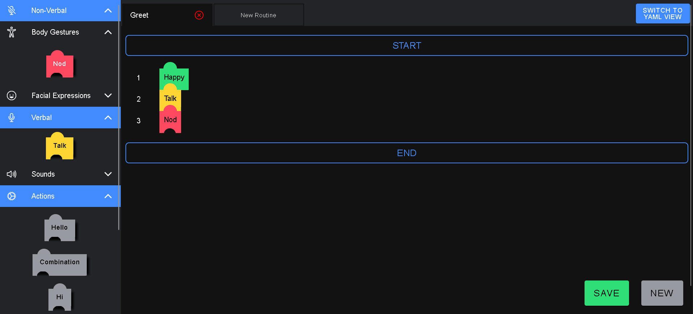
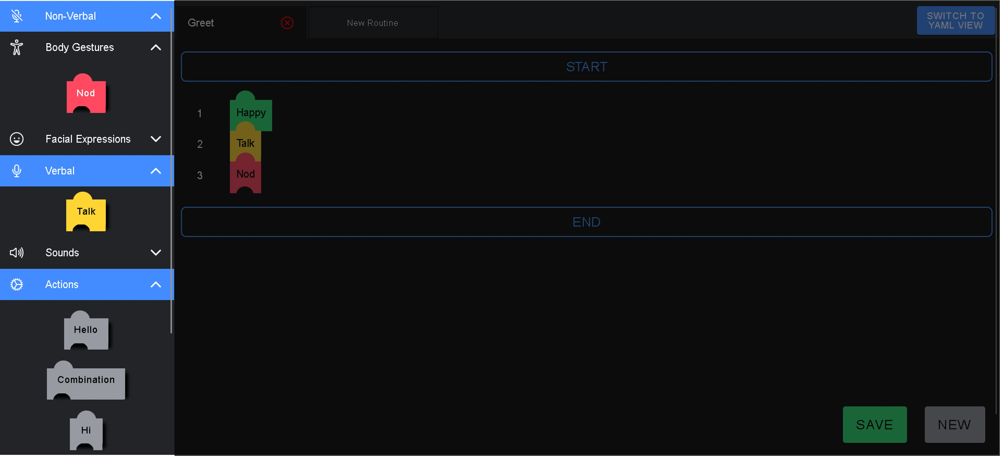

# Routine Building App - User Manual - Localhost

This project was generated with [Angular CLI](https://github.com/angular/angular-cli) version 16.2.0.

## Setupx

### Prerequisites

1. **Python Installation:**
   - Ensure Python is installed on your computer. You can download it [here](https://www.python.org/downloads/).
   - Add Python to your environment variables to run it from any terminal.

2. **Mongo DB Installation**
   - Ensure Mongo DB is installed in your machine. You can download it [here](https://www.mongodb.com/docs/manual/administration/install-community/).
     - The version used during development (as of November 2023) is mongodb-community@7.0
   - In case installation doesn't include it, install the [MongoDB Shell](https://www.mongodb.com/docs/mongodb-shell/install/).

3. **ROS installation**
   - Ensure ROS is installed on your machine. You can download ROS2 Iron, which is the ROS version used during the time of development (November 2023), [here](https://docs.ros.org/en/iron/index.html).
   - For this project, ROS2 Iron was chosen for the following reasons, you can learn more and compare with other versions [here](https://maker.pro/ros/tutorial/robot-operating-system-2-ros-2-introduction-and-getting-started):
     - ROS2 Iron has not reached EOL (as of time of development: November 2023).
     - ROS 2 is compatible with Ubuntu, Windows 10 and OS X.
     - Uses C++ 11 (potentially upgradeable) and Python3.
    - The OS used in this project for ROS2 installation was Ubuntu 22.04.3 LTS.
    

5. **NodeJS Installation:**
   - Download and install NodeJS from [this link](https://nodejs.org/en/download).
   - Use default settings during the installation.

### Installation

1. **Clone the Project:**
   - The project is hosted on GitHub at [Robot_UCSD_V2](https://github.com/DarthIV02/Robot_UCSD_v2).
   - Clone the repository to your computer (GitHub Desktop is recommended for easier management).

2. **Virtual Environment:**
   - Create a virtual environment by running the command:
     ```
     python -m venv ./venv
     ```
   - Activate the environment:
     - Windows: 
     ```
     venv\Scripts\activate
     ```
     - MacOS:
     ```
     source venv/bin/activate
     ```

3. **Python Requirements:**
   - Install Python requirements with the command:
     ```
     pip install -r requirements.txt
     ```

4. **Ionic App Dependencies:**
   - Install Ionic App dependencies with the following commands:
     - Windows:
     ```
     npm i @ionic/angular --legacy-peer-dev; npm install --legacy-peer-deps; npm install -g ionic; python ionicdone.txt
     ```
     - MacOS:
     ```
     npm i @ionic/angular --legacy-peer-dev && npm install --legacy-peer-deps && npm install -g ionic && python ionicdone.txt
     ```

5. **Database Connection:**
   - Two ways to connect to the database:
     1. For Cloud Database:
       - Navigate to the project directory.
       - Go to the backend folder and create a file named `.env`.
       - Add the following code to the `.env` file:
         ```
         password = "BFL2N3YtqbA45O9b"
         MONGO_USR = "access"
         ```
       - Run the command to connect to the database:
         ```
         python backend\app.py
         ```
     2. For Local Database:
       - Connect to local deployment, run mongosh without any options:
         ```
         mongosh
         ```

### Running Ionic App

1. Open a console window in the project directory.
2. To connect to the cloud database, activate the environment:
  - On Windows: 
  ```
  venv\Scripts\activate
  ```
  - On MacOS: 
  ```
  source venv/bin/activate
  ```
3. Connect to the cloud through the Python script: 
  ```
  python backend\app.py
  ```
4. Without terminating this script, open a new console window and run `ionic serve` on the project file.

## Usage

The app has 2 distinct areas, the sidebar where all of the available blocks are displayed, and the routine building area.



### Sidebar



The sidebar is an accordeon-type collection of blocks which are distributed in 3 groups:
* Non-Verbal: which include all of the actions that can be performed by the robot
  *  Body Gestures: Movements performed by the body of the robot
  *  Facial Expressions: Animations that can be presented in the screen of the robot
* Verbal: Which include all of the possible sounds that the robot can say through the speaker
* Actions: Previous curated routines

If you have doubts about a particular block, you can hover over any block and a small description is shown. And when right-clicking on an action block, a menu of options will display:


* Delete: Erases that routine from the current view and database
* Download: Will download the yaml file of that particular routine
* Modify: Will open a new tab with that rutine displayed

In the sidebar you can also find a underlined text <ins>Open Last Routine</ins>, which will open a new tab with the last opened routine.

### Routine window


Where you can build and modify routines to pass to a robot.

#### Tabs

On the top of the routine window, you can open multiple tabs. You can scroll through the tabs to edit different routine at the same time. You can also close tabs with the *x* button to the right of the tab. Make sure to save your routine before exiting tab as it will not save automatically.

#### Buttons

* **Switch to YAML view**: Will show the current routine as a text in yaml format. It will preview the yaml file that can be downloaded.
* **Save**: Will save the displayed routine in the database, if the name exists already then it will show a warning.
* **New**: Will open a new tab with a clean view to create a new routine.

### Building a routine

1. **Creating a New Routine:**
   - Drag and drop blocks from the sidebar to the routine building window on any tab.

2. **Setting Block Parameters:**
   - When you drop a block, a pop-up will appear to set its parameters.
   - Click **SAVE** in the pop-up to confirm and save the changes.

3. **Editing Block Parameters:**
   - To revisit a block's parameters, double-click on the block, and adjust as needed.

4. **Arranging Blocks:**
   - Rearrange blocks to dictate the order of actions for the robot.
   - Delete a block by dragging it outside the routine building area.

5. **Routine Management:**
   - Open a new tab or **Modify** an existing routine to edit it.

6. **Downloading Routine YAML File:**
   - Save the current routine > open a new tab > right-click on the routine's name in the sidebar > choose download.

7. **Concurrent Activities:**
   - Place multiple blocks in the same line to represent concurrent activities by the robot.

8. **Limitations on Actions in the Same Line:**
   - Only a single facial expression, body gesture, and verbal action can be placed in the same line.

9. **Exception for Verbal Actions:**
   - *Talk* is the only exception. You can place as many *Talk* blocks as you want in the same line, and they will be spoken in the order placed.

10. **Restrictions on Routine Blocks:**
    - Routine blocks cannot be placed in the same line as other blocks.

11. **Editing Subroutine Blocks:**
    - Double-click on dropped subroutine blocks in the routine window to edit them.

A simple demonstration can be seen in the following links:
- [https://drive.google.com/file/d/1hPsqvAbf1vdRfzkGWEs4vwR1_HJGKgbC/view?usp=drive_link](https://drive.google.com/file/d/1hPsqvAbf1vdRfzkGWEs4vwR1_HJGKgbC/view?usp=drive_link)
- [https://drive.google.com/file/d/1cBDQVMcxbD46XwsFDyl4aLgQ7TFK67Rx/view?usp=sharing](https://drive.google.com/file/d/1cBDQVMcxbD46XwsFDyl4aLgQ7TFK67Rx/view?usp=sharing)

### ROS: Notes on usage
- The `talker.py` and `listener.py` python scripts are taken from the documentation’s tutorials section.
  - In this example we’re not building packages, just running scripts.
- After following the installation instructions in the documentation, a `talker.py` file was created. In order to be able to execute it, it is necessary to set up the environment by sourcing the file with the following command:
```
source /opt/ros/iron/setup.bash
```
- Once the environment has been set up, talker.py can be executed within the Flask app through the route `127.0.0.1:5000/start_ros_talker`, the python script proceeds to publish messages.
- On another terminal tab (replicate same set up with `source /opt/ros/iron/setup.bash`) run the `listener.py` script can be executed and will receive the messages published by `talker.py`
