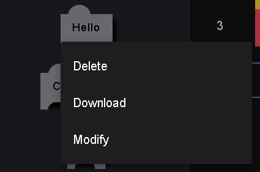
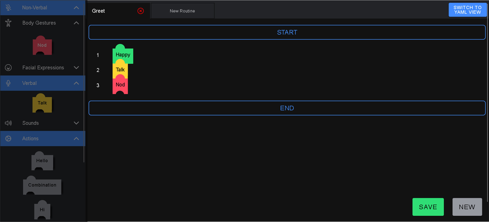

# Routine Building App - User Manual - Localhost

This project was generated with [Angular CLI](https://github.com/angular/angular-cli) version 16.2.0.

## Installation

### Project

The project is currently hosted on Github in the following link [Robot_UCSD_V2](https://github.com/DarthIV02/Robot_UCSD_v2). Clone the repository in your computer (it is recommended to clone using Github Desktop as it is easier to manage).

### Python

Make sure you have Python installed on your computer. Following this link [Python Download](https://www.python.org/downloads/). Make sure you add Python to the environment variables to be able to run python from comand prompt.
1) To create a virtual environment run the comand
python -m venv ./venv
2) Activate the environment
venv\Scripts\activate
3) Install all of the pyhton requirements.
pip install -r requirements.txt # This can be found inside the main directory

### Running Ionic App

First make sure you have NodeJS (you can download from [here](https://nodejs.org/en/download)). And setup all of the default settings.
On a console window run the command: 
npm i @ionic/angular --legacy-peer-dev
npm install --legacy-peer-devs # inside the project folder
npm install -g ionic

### COARS

In whichever browser you are running the application on, (tested on Firefox and Chrome). Install the extension "Allow CORS: Access-Control-Allow-Origin" with the logo seen bellow.

Once installed  make sure you "Toggle: ON" so that the logo is seen with colors and not gray. 

### MongoDB

#### Windows

#### MAC

## Conecting to the database

1) Open Comand Prompt or any console in your computer
2) Go to the direction of the project
3) Go to the backend folder
4) Create a file .env in backend folder
5) Add the following code to .env file:
password = "BFL2N3YtqbA45O9b"
MONGO_USR = "access"
7) Run the command to connect to the database
python backend\app.py
8) 

## Usage

The app has 2 distinct areas, the sidebar where all of the available blocks are displayed, and the routine building area.

### Sidebar

The sidebar is an accordeon-type collection of blocks which are distributed in 3 groups:
* Non-Verbal: which include all of the actions that can be performed by the robot
  *  Body Gestures: Movements performed by the body of the robot
  *  Facial Expressions: Animations that can be presented in the screen of the robot
* Verbal: Which include all of the possible sounds that the robot can say through the speaker
* Actions: Previous curated routines

If you have doubts about a particular block, you can hover over any block and a small description is shown. And when right-clicking on an action block, a menu of options will display:

* Delete: Erases that routine from the current view and database
* Download: Will download the yaml file of that particular routine
* Modify: Will open a new tab with that rutine displayed

In the sidebar you can also find a underlined text <ins>Open Last Routine</ins>, which will open a new tab with the last opened routine.

### Routine window

Where you can build and modify routines to pass to a robot.

#### Tabs

On the top of the routine window, you can open multiple tabs. You can scroll through the tabs to edit different routine at the same time. You can also close tabs with the *x* button to the right of the tab. Make sure to save your routine before exiting tab as it will not save automatically.

#### Buttons

* **Switch to YAML view**: Will show the current routine as a text in yaml format. It will preview the yaml file that can be downloaded.
* **Save**: Will save the displayed routine in the database, if the name exists already then it will show a warning.
* **New**: Will open a new tab with a clean view to create a new routine.

### Building a routine

1. **Creating a New Routine:**
   - Drag and drop blocks from the sidebar to the routine building window on any tab.

2. **Setting Block Parameters:**
   - When you drop a block, a pop-up will appear to set its parameters.
   - Click **SAVE** in the pop-up to confirm and save the changes.

3. **Editing Block Parameters:**
   - To revisit a block's parameters, double-click on the block, and adjust as needed.

4. **Arranging Blocks:**
   - Rearrange blocks to dictate the order of actions for the robot.
   - Delete a block by dragging it outside the routine building area.

5. **Routine Management:**
   - Open a new tab or **Modify** an existing routine to edit it.

6. **Downloading Routine YAML File:**
   - Save the current routine > open a new tab > right-click on the routine's name in the sidebar > choose download.

7. **Concurrent Activities:**
   - Place multiple blocks in the same line to represent concurrent activities by the robot.

8. **Limitations on Actions in the Same Line:**
   - Only a single facial expression, body gesture, and verbal action can be placed in the same line.

9. **Exception for Verbal Actions:**
   - *Talk* is the only exception. You can place as many *Talk* blocks as you want in the same line, and they will be spoken in the order placed.

10. **Restrictions on Routine Blocks:**
    - Routine blocks cannot be placed in the same line as other blocks.

11. **Editing Subroutine Blocks:**
    - Double-click on dropped subroutine blocks in the routine window to edit them.

A simple demonstration can be seen in the following links:
- [https://drive.google.com/file/d/1hPsqvAbf1vdRfzkGWEs4vwR1_HJGKgbC/view?usp=drive_link](https://drive.google.com/file/d/1hPsqvAbf1vdRfzkGWEs4vwR1_HJGKgbC/view?usp=drive_link)
- [https://drive.google.com/file/d/1cBDQVMcxbD46XwsFDyl4aLgQ7TFK67Rx/view?usp=sharing](https://drive.google.com/file/d/1cBDQVMcxbD46XwsFDyl4aLgQ7TFK67Rx/view?usp=sharing)
